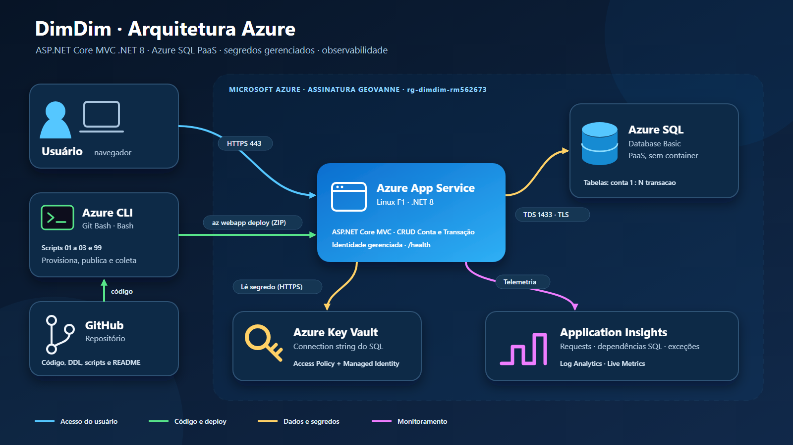

# DimDim · Web App .NET com Azure SQL

Aplicação web do banco DimDim para controle financeiro, com dashboard e CRUD de `Conta` e `Transacao` (`Conta 1:N Transacao`). Roda no Azure App Service, persiste os dados no Azure SQL Database (PaaS, sem container) e é monitorada pelo Application Insights.

A solução possui front-end e não é uma API, por isso não há JSON de operações GET, POST, PUT e DELETE.

## Integrantes

- `[NOME — RM]`

## Vídeo

`[URL DO VÍDEO]`

## Arquitetura



O navegador acessa o App Service por HTTPS. A aplicação consulta o Azure SQL por conexão criptografada, lê a connection string do Key Vault com identidade gerenciada e envia telemetria ao Application Insights.

## Tecnologias

- ASP.NET Core MVC, C# e .NET 8, EF Core 8 e Bootstrap
- Azure App Service Linux (F1) e Azure SQL Database (Basic)
- Azure Key Vault, Application Insights e Log Analytics
- Azure CLI e scripts Bash

## Estrutura

```text
DimDim.sln
├── src/DimDim.Web/              # aplicação MVC
├── scripts/
│   ├── config.sh                # RM, região, assinatura e nomes dos recursos
│   ├── ddl.sql                  # tabelas, PK, FK, checks, índices e dados iniciais
│   ├── 01-provisionar-infra.sh  # cria os recursos e aplica o DDL
│   ├── 02-deploy-app.sh         # publica a aplicação com az webapp deploy
│   ├── 03-verificar-ambiente.sh  # consulta recursos, telemetria, métricas e dados
│   └── 99-limpar-recursos.sh    # remove todos os recursos
└── docs/arquitetura.png
```

# How-to

## Pré-requisitos

- Conta Azure com permissão para criar recursos
- [Azure CLI](https://learn.microsoft.com/cli/azure/install-azure-cli)
- [sqlcmd](https://learn.microsoft.com/sql/tools/sqlcmd/sqlcmd-utility)
- [.NET 8 SDK](https://dotnet.microsoft.com/download/dotnet/8.0)
- Git Bash (Windows) ou terminal Bash (Linux/macOS)

Execute todos os comandos no Git Bash, na raiz do repositório.

## 1. Clonar o repositório

```bash
git clone https://github.com/GuuiSOares/dimdim-webapp.git
cd dimdim-webapp
```

## 2. Entrar no Azure

```bash
az login
az account list --query '[].name' -o table
```

O segundo comando lista o nome das assinaturas disponíveis na sua conta.

## 3. Configurar

Edite as três primeiras variáveis de `scripts/config.sh`:

```bash
RM="rm562673"
LOCATION="spaincentral"
AZURE_SUBSCRIPTION_NAME="Geovanne"
```

| Variável | Valor |
|---|---|
| `RM` | Seu RM. Os nomes dos recursos são gerados a partir dele e precisam ser únicos no Azure |
| `LOCATION` | Região permitida na sua assinatura |
| `AZURE_SUBSCRIPTION_NAME` | Nome da assinatura listada no passo 2 |

Os scripts selecionam a assinatura automaticamente a partir desse arquivo.

## 4. Provisionar a infraestrutura e o banco

```bash
bash scripts/01-provisionar-infra.sh
```

O script solicita a confirmação da assinatura (`SIM`), um usuário administrador e uma senha para o SQL. Usuário e senha não são gravados em arquivo.

Recursos criados:

- Resource Group, Log Analytics e Application Insights
- Key Vault com a connection string do banco
- Azure SQL Server e Database Basic, com firewall liberado para serviços Azure e para o IP de quem executa o script
- App Service Plan F1 Linux e Web App .NET 8 com identidade gerenciada, HTTPS, TLS 1.2 e health check em `/health`

Ao final, `scripts/ddl.sql` é aplicado e o terminal exibe `Infraestrutura pronta.`.

Conferência:

```bash
source scripts/config.sh
az resource list -g "$RESOURCE_GROUP" --query '[].{nome:name,tipo:type}' -o table
```

## 5. Publicar a aplicação

```bash
bash scripts/02-deploy-app.sh
```

O script compila em Release, gera o pacote ZIP, publica com `az webapp deploy` e aguarda o `/health` responder `200`. Ao final, exibe a URL da aplicação.

## 6. Usar a aplicação e validar a persistência

Abra a URL exibida no passo anterior. Em outro terminal, conecte ao banco:

```bash
source scripts/config.sh
SQL_ADMIN_USER="$(az sql server show -g "$RESOURCE_GROUP" -n "$SQL_SERVER_NAME" --query administratorLogin -o tsv)"
read -r -s -p "Senha SQL: " SQLCMDPASSWORD; echo
export SQLCMDPASSWORD
sqlcmd -S "tcp:${SQL_SERVER_NAME}.database.windows.net,1433" \
  -d "$SQL_DATABASE_NAME" -U "$SQL_ADMIN_USER" -f 65001
```

Consultas de validação (no `sqlcmd`, finalize com `GO`):

```sql
SELECT id, nome, instituicao, tipo, saldo_inicial FROM dbo.conta ORDER BY id;
GO
```

```sql
SELECT t.id, t.descricao, t.valor, t.tipo, t.data, c.nome AS conta
FROM dbo.transacao t JOIN dbo.conta c ON c.id = t.conta_id
ORDER BY t.id;
GO
```

Execute cada operação na aplicação e, em seguida, a consulta da tabela correspondente:

| Operação | Conta (menu Contas) | Transação (menu Transações) |
|---|---|---|
| Create | **Nova conta** → preencher → **Salvar** | **Nova transação** → escolher a conta → **Salvar** |
| Read | Abrir a lista e os detalhes da conta | Abrir a lista e os detalhes da transação |
| Update | **Editar** → alterar dados → **Salvar** | **Editar** → alterar valor ou tipo → **Salvar** |
| Delete | **Excluir** em uma conta sem transações | **Excluir** na transação |

Uma conta com transações não pode ser excluída; a aplicação exibe uma mensagem de bloqueio.

Para sair do `sqlcmd`, digite `QUIT` e execute `unset SQLCMDPASSWORD SQL_ADMIN_USER`.

## 7. Verificar recursos, telemetria e dados

```bash
bash scripts/03-verificar-ambiente.sh
```

Exibe os recursos, o health check, as requisições e dependências SQL registradas no Application Insights, as métricas do banco e os registros das duas tabelas.

## 8. Monitorar a aplicação e o banco

**Application Insights** (Portal Azure → `appi-dimdim-<RM>`):

- **Live Metrics:** requisições em tempo real
- **Desempenho:** tempo de resposta por operação
- **Mapa do aplicativo:** chamadas da aplicação ao Azure SQL
- **Falhas:** exceções e requisições com erro
- **Logs:** consultas abaixo

```kusto
requests | where timestamp > ago(30m)
| project Horario=timestamp, Requisicao=name, CodigoHTTP=resultCode,
          Sucesso=success, Duracao=duration
| order by Horario desc
```

```kusto
dependencies | where timestamp > ago(30m) and type has "SQL"
| project Horario=timestamp, Dependencia=name, Destino=target,
          Sucesso=success, Duracao=duration
| order by Horario desc
```

**Azure SQL** (Portal Azure → banco `sqldb-dimdim`, tipo **Banco de dados SQL**):

1. Menu **Monitoramento → Métricas**.
2. Adicione as métricas **CPU percentage**, **DTU percentage**, **Data space used**, **Successful connections** e **Failed connections**.
3. Selecione o período dos últimos 30 minutos.

## 9. Remover os recursos

```bash
bash scripts/99-limpar-recursos.sh
```

O script pede o nome do Resource Group (`rg-dimdim-<RM>`) e a palavra `EXCLUIR`. Em seguida, exclui o grupo e purga o Key Vault para permitir recriar o ambiente com os mesmos nomes.

## Executar localmente (opcional)

Usa SQLite, sem recursos Azure:

```powershell
dotnet run --project .\src\DimDim.Web\DimDim.Web.csproj
```

Se a máquina tiver apenas um runtime .NET mais recente que o 8, defina antes `$env:DOTNET_ROLL_FORWARD = "Major"`.

## Segurança

- Nenhuma senha, usuário ou token é versionado.
- A connection string fica no Key Vault e é lida pelo Web App via identidade gerenciada.
- O firewall do SQL libera apenas serviços Azure e o IP de quem executa o script 01.
- HTTPS obrigatório, TLS 1.2 e FTPS desabilitado no Web App.

## Problemas comuns

| Problema | Solução |
|---|---|
| Região bloqueada pela política da assinatura | Altere `LOCATION` em `scripts/config.sh` para uma região permitida |
| Nome de recurso já em uso | Altere `UNIQUE_SUFFIX` em `scripts/config.sh` |
| `sqlcmd` não conecta | Execute novamente o script `01` para liberar o IP atual |
| Erro 500 ao acessar o Key Vault | Aguarde a propagação da política de acesso e reinicie o Web App |
| `/health` não retorna 200 | `az webapp log tail -g "$RESOURCE_GROUP" -n "$WEBAPP_NAME"` |
| Application Insights sem dados | Gere tráfego na aplicação e aguarde alguns minutos |
